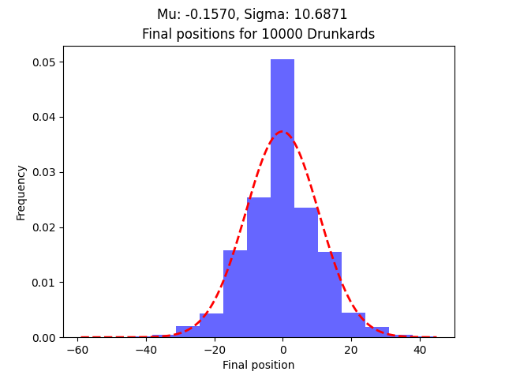
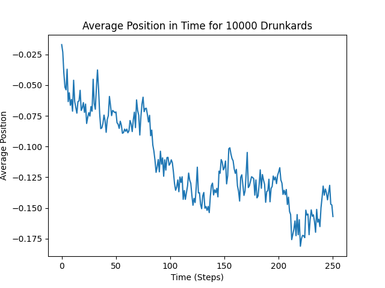
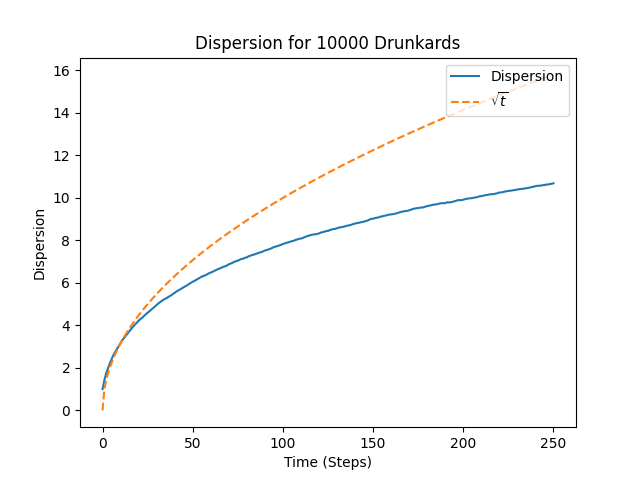
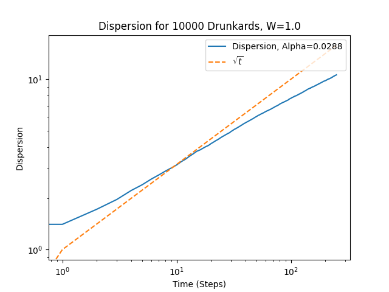

# 🥃 DrunkardWalkSD

This is a study repository for a modified  version of the classical, one-dimensional, **random walk**, commonly known as the **drunkard's walk**. The original version can be found in [this repository](https://github.com/OffworldAstronaut/DrunkardWalk).

In this version, each position of the sidewalk has its **own coin**, introducing spatial randomness into the system.

The repository is structured following OOP principles and Python module formatting.

## Features

- Simulate a single random walker (drunkard) on a one-dimensional sidewalk with position-dependent coin probabilities;

- Automatically assign random step probabilities to each sidewalk position;

- Run multiple simulations (walkers) sequentially to analyze ensemble behavior;

- Calculate and plot:

  - The path of a single walker;

  - The average position across multiple walkers;

  - The standard deviation (dispersion) across multiple walkers;

   - The histogram of final positions across multiple walkers.

### Random Coins

Unlike traditional random walk implementations with a fixed step probability, this version generates a different "coin" for each sidewalk position, with each coin having a probability of stepping right, drawn from a uniform distribution.

The width of this distribution, centered around 0.5, is controlled by the ``coin_W`` parameter.

This introduces a break in the symmetry to the random walk dynamics.

## Structure 

### Classes

- **``Drunkard``**: Represents a walker that moves based on the coin associated with the current position.

- **``Sidewalk``**: One-dimensional environment where each position has a distinct coin. Manages the walk of a single drunkard.

- **``City``**: Simulates multiple sidewalks with their own random coin distributions, enabling ensemble statistics.

### 📊 Example Outputs

The simulation generates **``.png``** plots such as:

**``AvgPos_...png``**: Average position of multiple walkers over time.

**``Disp_...png``**: Dispersion (standard deviation) of positions among all walkers (linear or loglog).

**``EndPos_...png``**: Histogram of ending positions of multiple walkers.

## Installation

The requirements can be installed via pip.

### Method 1

```bash
pip install git+https://github.com/OffworldAstronaut/DrunkardWalk-RandomCoin.git
```

### Method 2

```bash
git clone https://github.com/OffworldAstronaut/DrunkardWalkSD 
cd DrunkardWalkSD 
pip install .
```

## Usage 

### 1. Run a Single Walker Simulation 

```py
sidewalk = Sidewalk(size=100, coin_p=0.5)
sidewalk.wander(end_step=1000)
sidewalk.make_wandering_plot()
```

### 2. Run a Multi-Walker Simulation 

```py 
# This code is on example.py

iimport DrunkardWalkSD as DWSD

quantity_sidewalks = 10_000
size_sidewalks = 500
disorder_intensity = 1.0

city = DWSD.City(quantity_sidewalks, size_sidewalks, disorder_intensity)

city.roam()

city.make_avg_graph(plot_only=False)
city.make_std_graph(plot_only=True, loglog=True)
city.make_endpos_graph()
```

### Plot Examples 

**Final positions histogram**



**Average positions plot**



**Dispersion plot**


